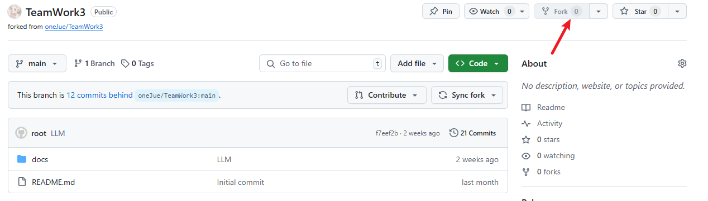
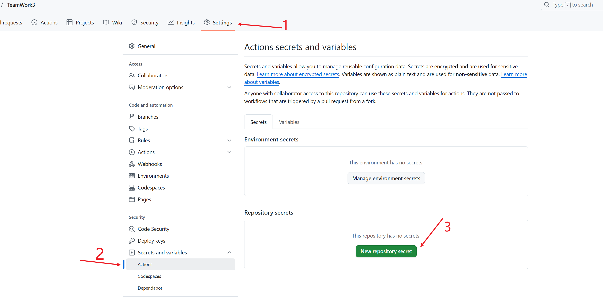

<h3 align="center">ZX (Zotero - arXiv Academic Daily) 学术日报</h3>

---

<p align="center"> 根据你的Zotero图书馆每天推荐你感兴趣的新论文
    <br> 
</p>
请关注此 repo，并在上游有任何更新时及时合并您 forked repo，以便享受新功能并修复发现的错误。

## 🧐 关于 <a name = "about"></a>

> 只需fork（并关注）此 repo 即可追踪您感兴趣的新科学研究！😊

本产品将与用户的 Zotero 图书馆深度集成，基于用户在 Zotero 中的自然文献内容，运用先进的算法和语言处理技术，每日精准筛选出 arXiv 上与用户研究兴趣高度相关的预印论文本。并且，将以邮件的形式自动给用户，收藏用户无需手动检索，即可及时获取最新的研究成果。

## ✨ 特点
- 完全免费！所有计算均可在 Github Action Runner 本地完成，且在其配额范围内（适用于公共仓库）。
- 主要从arXiv平台获取论文，同时接入更多的学术资源，如Google Scholar、dblp等数据库，以保证您获得最新文献信息。
- 根据您的Zotero图书馆的文献内容近期阅读记录进行个性化推荐。
- 根据论文的主题和内容，自动分类推荐论文，让您更方便地找到与自己研究方向相关的论文。
- 为每篇推荐论文生成摘要，帮助您快速了解论文的核心内容。
- 集成现有的翻译API，为您翻译论文摘要。
- 根据您的需求，灵活配置各项功能，如文献过滤、数量调整、模型选择、语言设置、深度设置、话题追问、多维对比等。
- 电子邮件中提供 PDF 和代码实现（如果有）的链接。
- 通过 fork 此 repo 并在 Github Action Page 中设置环境变量进行快速部署。
- 支持 LLM API 生成论文的 TL;DR。
- 使用 gitignore 样式模式忽略不需要的 Zotero 论文。

## 📷 产品截图


## 🚀 使用方法
### 快速开始
1. `Fork` 此仓库。


2. 设置 `Github Action` 环境变量。


以下是您需要设置的所有密钥。设置后，这些密钥将对任何人（包括您自己）不可见，以确保安全。

| 键 | 是否必需 | 类型 | 描述 | 示例 |
| :--- | :---: | :---  | :---  | :--- |
| ZOTERO_ID | ✅ | str  | 您的 Zotero 账户用户 ID。**用户 ID 不是您的用户名，而是一串数字**。您可以通过 [此链接](https://www.zotero.org/settings/security) 获取您的 ID，位置如 [此截图](./docs/Products/assets/userid.png) 所示。 | 12345678  |
| ZOTERO_KEY | ✅ | str  | 具有读取权限的 Zotero API 密钥。您可以通过 [此链接](https://www.zotero.org/settings/security) 获取密钥。  | AB5tZ877P2j7Sm2Mragq041H   |
| ARXIV_QUERY | ✅ | str  | 目标 arxiv 论文的类别。使用 `+` 连接多个类别。例如，此示例检索关于 AI、CV、NLP、ML 的论文。您可以通过 [此链接](https://arxiv.org/category_taxonomy) 查找您研究领域的缩写。  | cs.AI+cs.CV+cs.LG+cs.CL |
| SMTP_SERVER | ✅ | str | 发送邮件的 SMTP 服务器。建议使用一个不常用的邮箱。向您的邮箱提供商（Gmail、QQ、Outlook 等）询问其 SMTP 服务器地址。| smtp.qq.com |
| SMTP_PORT | ✅ | int | SMTP 服务器的端口。 | 465 |
| SENDER | ✅ | str | 发送邮件的 SMTP 服务器邮箱账号。 | abc@qq.com |
| SENDER_PASSWORD | ✅ | str | 发送方账号的密码。注意，这不一定是登录邮箱客户端的密码，而是 SMTP 服务的授权码。向您的邮箱提供商咨询此信息。   | abcdefghijklmn |
| RECEIVER | ✅ | str | 接收论文列表的邮箱地址。 | abc@outlook.com |
| MAX_PAPER_NUM | | int | 邮件中显示的论文最大数量。此值直接影响此工作流的执行时间，因为生成一篇论文的 TL;DR 大约需要 70 秒。`-1` 表示显示所有检索到的论文。 | 50 |
| SEND_EMPTY | | bool | 即使当天没有新论文，是否发送空邮件。 | False |
| USE_LLM_API | | bool | 是否使用云端的 LLM API，还是使用本地的 LLM。如果设置为 `1`，则使用 API；否则，如果设置为 `0`，工作流将下载并部署一个开源的 LLM。默认为 `0`。 | 0 |
| OPENAI_API_KEY | | str | 使用 API 访问 LLM 时的 API 密钥。您可以在 [SiliconFlow](https://cloud.siliconflow.cn/i/b3XhBRAm) 获取免费的 API，以使用高级开源 LLM。 | sk-xxx |
| OPENAI_API_BASE | | str | 使用 API 访问 LLM 时的 API URL。如果未填写，默认为 OpenAI 的 URL。 | https://api.siliconflow.cn/v1  |
| MODEL_NAME | | str | 使用 API 访问 LLM 时的模型名称。如果未填写，默认为 gpt-4o。使用 [SiliconFlow](https://cloud.siliconflow.cn/i/b3XhBRAm) 时，推荐使用 Qwen/Qwen2.5-7B-Instruct。 | Qwen/Qwen2.5-7B-Instruct |

还有一些公共变量（仓库变量），您可以轻松编辑这些变量。


| 键 | 是否必需 | 类型 | 描述 | 示例 |
| :--- | :---  | :---  | :--- | :--- |
| ZOTERO_IGNORE | | str | 使用 gitignore 风格的模式标记应忽略的 Zotero 集合。每行一个规则。了解更多关于 [gitignore](https://git-scm.com/docs/gitignore) 的信息。 | AI Agent/<br>**/survey<br>!LLM/survey |
| REPOSITORY | | str | 提供工作流的仓库。如果设置，值只能是 `oneJue/TeamWork3`，在这种情况下，工作流始终从该上游仓库拉取最新代码，因此您无需在每次更新时同步您的分叉仓库，除非工作流文件被更改。 | `oneJue/TeamWork3` |
| LANGUAGE | | str | TLDR 的语言；其值直接嵌入传递给 LLM 的提示中。 | Chinese |

默认情况下，主工作流每天在 22:00 UTC 运行。您可以通过编辑工作流配置 `.github/workflows/main.yml` 来更改此时间。

> [!注意]
> 每天自动触发，并检索昨天发布的新论文。在周末和节假日没有新的 arxiv 论文，在这种情况下，您可能会在日志中看到“未找到新论文”。

<!-- ### 本地运行
如果安装了 [uv](https://github.com/astral-sh/uv)，此工作流可以在本地设备上轻松运行：
```bash
# 设置所有环境变量
# export ZOTERO_ID=xxxx
# ...
cd TeamWork3
uv run main.py
``` -->

## 📖 工作原理
首先通过相应的 API 检索您 Zotero 库中的所有论文以及前一天发布的所有论文。然后，它通过嵌入模型计算每篇论文摘要的嵌入向量。论文的得分是其与您 Zotero 论文的加权平均相似度（新添加到库中的论文具有更高的权重）。
每篇论文的 TLDR 由LLM生成的，给定其标题、摘要、引言和结论等。

## 📌 限制
<!-- - 推荐算法非常简单，可能无法准确反映您的兴趣。欢迎提出改进算法的更好想法！ -->
- 此工作流在 Github Action 运行器的 CPU 上部署了一个 LLM，生成一篇论文的 TLDR 大约需要 70 秒。较高的 `MAX_PAPER_NUM` 可能会导致执行时间超出 Github Action 运行器的限制（公共仓库每次执行 6 小时，私人仓库每月 2000 分钟）。通常，公共仓库的配额绝对足够个人使用。如果您有特殊需求，可以在您自己的服务器上部署工作流，或者使用自托管的 Github Action 运行器，或者支付超出的执行时间费用。
